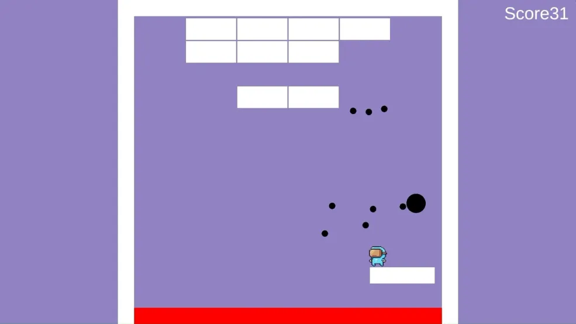

# BREAK&DODGE

## 概要
Unityで制作した、「ブロック崩し×弾幕」ゲームです．
プレイヤーはジャンプや移動を駆使して弾幕を回避しながら、ブロック崩しをします．
プレイヤー操作とパドル操作を同時に行うことで，従来のブロック崩しとは異なるゲーム体験を目指しました．

---

## 制作期間
約2週間(個人製作)

---

## 開発環境
- Unity
- C#
- Visual Studio

---

## ゲームルール
ボールやプレイヤーが落ちてしまったり，ボール・弾幕に触れてしまうとアウト．
壊したブロックの数がスコアとなるので，高スコアを目指しましょう．

---

## 操作方法
| 操作 | キーボード | コントローラー |
|------|-----|-----|
| 移動 | A/D | 左スティック |
| ジャンプ | Space | Southボタン |
| パドル移動 | J/L | L1/R1 |

---

## スクリーンショット

---

## プレイ動画
[プレイ動画](https://drive.google.com/file/d/1AAVQxz4Nr9qUJcUn-MESfPt7xRS2Uki9/view?usp=drivesdk)

---

## 技術的な工夫

### プレイヤーとパドル操作
プレイヤーキャラクターとブロック崩しのパドルを別クラスで管理することでそれぞれの挙動を独立して制御できるように設計しました。

例
- PlayerController
- PaddleController

これにより操作ロジックの責務を分離し、拡張しやすいかつ把握しやすい構造にしています．

### オブジェクトごとの役割
ゲーム内オブジェクトごとにクラスを分割し、役割が明確になるように設計しました．また，このように設計することで拡張するとなった時に構造の複雑化を防ぐこともできます．

主なクラス
- GameManeger：ゲーム状態の管理
- BlockSpawner：ブロックの再生成の管理
- TalletManager：弾幕の射出の管理
など

### ボールのパドル反射
既存の物理エンジンだけでブロック崩しを製作してしまうと，ボールが左右に反射し続ける「詰み」状態になってしまいます．そのため，パドルにボールがぶつかった際は専用の反射処理をすることで詰まないようにしています．

---

## 今後の改善点
- スコアの保存・他プレイヤーとのランキング機能
- ステージ・弾幕パターンの追加
- エフェクト・サウンドの追加

---

## 実行方法
1. Buildフォルダをダウンロード
2. BREAK&DODGE.exe を実行